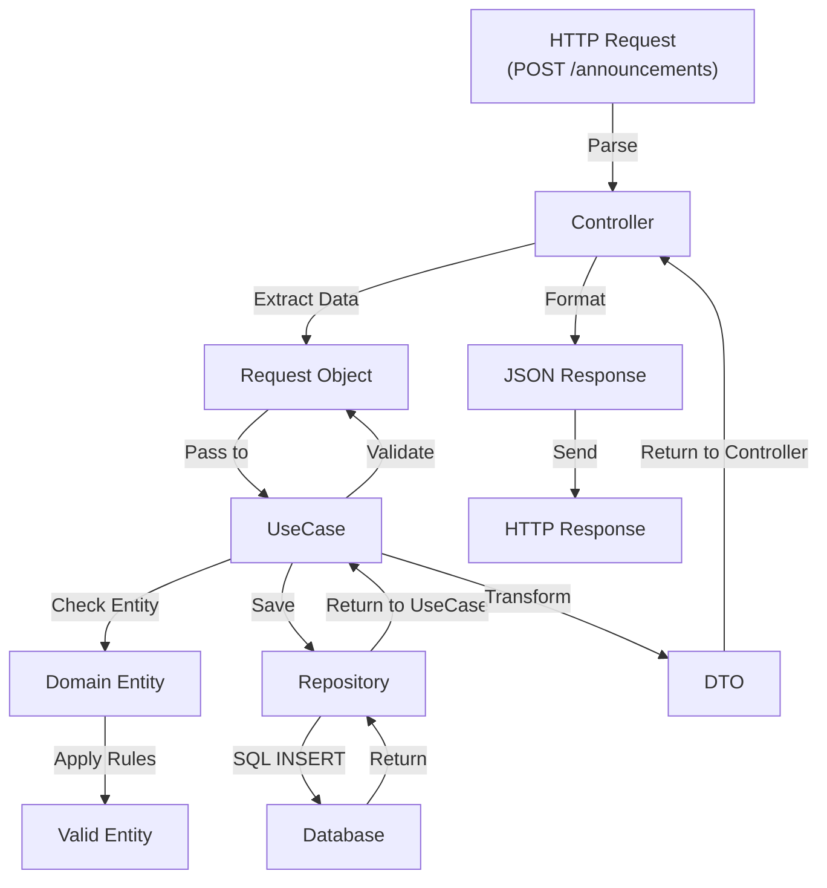

# Application Layer - API Reference

Warstwa Application orkiestruje logikę biznesową, koordinując interakcje między Presentation a Domain Layer.

## 📍 Struktura Application Layer

```
src/Application/
├── UseCase/                        # Główne scenariusze użytkownika
│   ├── Announcement/
│   │   ├── CreateAnnouncementUseCase.php
│   │   ├── ApproveAnnouncementUseCase.php
│   │   ├── RejectAnnouncementUseCase.php
│   │   ├── DeleteAnnouncementUseCase.php
│   │   └── ListAnnouncementsUseCase.php
│   ├── Word/
│   │   ├── CreateWordUseCase.php
│   │   ├── UpdateWordUseCase.php
│   │   └── ListWordsUseCase.php
│   ├── Quote/
│   │   └── ... (similar structure)
│   ├── User/
│   │   ├── RegisterUserUseCase.php
│   │   ├── LoginUserUseCase.php
│   │   └── UpdateUserUseCase.php
│   └── Module/
│       └── ...
└── DataTransferObject/             # Data Transfer Objects
    ├── AnnouncementDTO.php
    ├── UserDTO.php
    ├── WordDTO.php
    ├── QuoteDTO.php
    └── ...
```

**Namespace**: `App\Application\`

---

## 🎬 Use Cases

Use Case reprezentuje pojedynczy, znaczący scenariusz użytkownika.

### Announcement Use Cases

#### CreateAnnouncementUseCase

**Lokalizacja**: `src/Application/UseCase/Announcement/CreateAnnouncementUseCase.php`

**Odpowiedzialność**: Obsługa tworzenia nowego ogłoszenia

**Zależności**:
```php
public function __construct(
    private AnnouncementRepository $announcementRepository,
    private LoggerInterface $logger
)
```

**Metoda Execute**:
```php
public function execute(CreateAnnouncementRequest $request): AnnouncementDTO
```

**Parametry**: `CreateAnnouncementRequest`
- `string $title` - Tytuł ogłoszenia
- `string $text` - Treść ogłoszenia
- `string $validUntil` - Data wygaśnięcia (ISO 8601)
- `int $userId` - ID twórcy (opcjonalnie)

**Zwraca**: `AnnouncementDTO` - Nowe ogłoszenie

**Flow**:
1. Waliduje request (tytuł, tekst nie puste, validUntil w przyszłości)
2. Tworzy Domain Entity (Announcement)
3. Zapisuje w Repository
4. Zwraca DTO dla front-endu

**Wyjątki**:
- `AnnouncementException` - Błąd biznesowy
- `ValidationException` - Błąd walidacji

**Użycie w Controller**:
```php
class AnnouncementController {
    public function __construct(
        private CreateAnnouncementUseCase $useCase
    ) {}
    
    public function create(Request $request): Response {
        try {
            $dto = new CreateAnnouncementRequest(
                title: $request->input('title'),
                text: $request->input('text'),
                validUntil: $request->input('valid_until'),
                userId: $request->userId // from auth
            );
            
            $result = $this->useCase->execute($dto);
            return Response::created($result);
        } catch (ValidationException $e) {
            return Response::badRequest($e->getMessage());
        }
    }
}
```

---

#### ApproveAnnouncementUseCase

**Lokalizacja**: `src/Application/UseCase/Announcement/ApproveAnnouncementUseCase.php`

**Odpowiedzialność**: Zatwierdzenie ogłoszenia oczekującego

**Metoda Execute**:
```php
public function execute(int $announcementId, int $adminId): AnnouncementDTO
```

**Parametry**:
- `int $announcementId` - ID ogłoszenia do zatwierdzenia
- `int $adminId` - ID admina zatwierdzającego

**Zwraca**: `AnnouncementDTO` - Zatwierdzone ogłoszenie

**Flow**:
1. Pobiera Announcement z Repository
2. Sprawdza czy istnieje i ma status PENDING
3. Wywoła `$announcement->approve($adminId)` (logika domenowa)
4. Zapisuje w Repository
5. Zwraca DTO

**Wyjątki**:
- `AnnouncementNotFoundException`
- `AnnouncementException` - Jeśli status nie PENDING

---

#### RejectAnnouncementUseCase

**Lokalizacja**: `src/Application/UseCase/Announcement/RejectAnnouncementUseCase.php`

**Odpowiedzialność**: Odrzucenie ogłoszenia oczekującego

**Metoda Execute**:
```php
public function execute(int $announcementId, int $adminId, string $reason): AnnouncementDTO
```

**Parametry**:
- `int $announcementId` - ID ogłoszenia do odrzucenia
- `int $adminId` - ID admina odrzucającego
- `string $reason` - Powód odrzucenia (dla archiwum)

**Zwraca**: `AnnouncementDTO` - Odrzucone ogłoszenie

---

#### ListAnnouncementsUseCase

**Lokalizacja**: `src/Application/UseCase/Announcement/ListAnnouncementsUseCase.php`

**Odpowiedzialność**: Pobranie listy aktualnych ogłoszeń

**Metoda Execute**:
```php
public function execute(ListAnnouncementsRequest $request): array
```

**Parametry**: `ListAnnouncementsRequest`
- `int $page = 1` - Numer strony
- `int $perPage = 10` - Ilość na stronę
- `string $status = 'approved'` - Filtr po statusie
- `bool $validOnly = true` - Czy tylko ważne

**Zwraca**: `array<AnnouncementDTO>` - Lista ogłoszeń

**Flow**:
1. Buduje query z filtrami
2. Stosuje paginację
3. Pobiera z Repository
4. Transformuje do DTOs
5. Zwraca wraz z metadanymi

---

### User Use Cases

#### RegisterUserUseCase

**Lokalizacja**: `src/Application/UseCase/User/RegisterUserUseCase.php`

**Odpowiedzialność**: Rejestracja nowego użytkownika

**Metoda Execute**:
```php
public function execute(RegisterUserRequest $request): UserDTO
```

**Parametry**: `RegisterUserRequest`
- `string $email` - Email użytkownika
- `string $password` - Hasło (raw)
- `string $name` - Nazwa użytkownika
- `?string $phoneNumber` - Numer telefonu

**Zwraca**: `UserDTO` - Nowy użytkownik (bez hasła!)

**Walidacja**:
- Email nie może istnieć
- Hasło musi spełniać wymagania
- Email musi być ważny

**Bezpieczeństwo**:
- Hasło zahaszowane na level Infra (SecurityService)
- Brak hasła w response

---

#### LoginUserUseCase

**Lokalizacja**: `src/Application/UseCase/User/LoginUserUseCase.php`

**Odpowiedzialność**: Logowanie użytkownika

**Metoda Execute**:
```php
public function execute(LoginUserRequest $request): LoginResponse
```

**Parametry**: `LoginUserRequest`
- `string $email` - Email
- `string $password` - Hasło (raw)

**Zwraca**: `LoginResponse`
- `UserDTO $user`
- `string $token` - JWT lub session token

---

### Word Use Cases

#### CreateWordUseCase

**Lokalizacja**: `src/Application/UseCase/Word/CreateWordUseCase.php`

Tworzy nowe słowo dnia.

#### ListWordsUseCase

Pobiera słowa z paginacją.

---

## 📦 Data Transfer Objects (DTOs)

DTOs transportują dane między warstwami bez logiki biznesowej.

### AnnouncementDTO

**Lokalizacja**: `src/Application/DataTransferObject/AnnouncementDTO.php`

```php
final class AnnouncementDTO {
    public function __construct(
        public int     $id,
        public string  $title,
        public string  $text,
        public string  $createdAt,      // ISO 8601
        public string  $validUntil,     // ISO 8601
        public ?int    $userId,
        public string  $status,         // 'pending', 'approved', 'rejected'
        public ?string $decidedAt,      // ISO 8601
        public ?int    $decidedBy,
    ) {}
    
    public static function fromEntity(Announcement $entity): self {
        return new self(
            id: $entity->id,
            title: $entity->title,
            text: $entity->text,
            createdAt: $entity->createdAt->format('c'),
            validUntil: $entity->validUntil->format('c'),
            userId: $entity->userId,
            status: $entity->status->name,
            decidedAt: $entity->decidedAt?->format('c'),
            decidedBy: $entity->decidedBy,
        );
    }
}
```

**Użycie**: Transformacja Entity → JSON Response
```php
return [
    'data' => AnnouncementDTO::fromEntity($announcement)
];
```

### UserDTO

**Lokalizacja**: `src/Application/DataTransferObject/UserDTO.php`

```php
final class UserDTO {
    public function __construct(
        public int    $id,
        public string $email,
        public string $name,
        public ?string $phoneNumber,
        public string $role,
        // UWAGA: Nigdy nie include password!
    ) {}
    
    public static function fromEntity(User $entity): self {
        return new self(
            id: $entity->id,
            email: $entity->email,
            name: $entity->name,
            phoneNumber: $entity->phoneNumber,
            role: $entity->role,
        );
    }
}
```

---

## 🏗️ Request Objects (Request DTOs)

Request objects enkapsulują dane wejściowe.

### CreateAnnouncementRequest

```php
final class CreateAnnouncementRequest {
    public function __construct(
        public string $title,
        public string $text,
        public string $validUntil,     // ISO 8601
        public ?int   $userId = null,
    ) {}
    
    public function validate(): array {
        $errors = [];
        
        if (empty($this->title)) {
            $errors[] = "Title is required";
        }
        
        if (strlen($this->title) > 200) {
            $errors[] = "Title is too long";
        }
        
        if (empty($this->text)) {
            $errors[] = "Text is required";
        }
        
        if (strlen($this->text) > 5000) {
            $errors[] = "Text is too long";
        }
        
        try {
            $date = new DateTimeImmutable($this->validUntil);
            if ($date <= new DateTimeImmutable()) {
                $errors[] = "Valid until must be in the future";
            }
        } catch (Exception $e) {
            $errors[] = "Invalid date format";
        }
        
        return $errors;
    }
    
    public function isValid(): bool {
        return empty($this->validate());
    }
}
```

**Użycie w Use Case**:
```php
public function execute(CreateAnnouncementRequest $request): AnnouncementDTO {
    $errors = $request->validate();
    if (!empty($errors)) {
        throw new ValidationException($errors);
    }
    
    // ... proceed
}
```

---

## 🔄 Typowy Flow Use Case

```
HTTP Request
    ↓
Controller
├─ 1. Parse request → CreateAnnouncementRequest
├─ 2. Get UseCase from DI Container
├─ 3. Call useCase->execute($request)
    ↓
UseCase
├─ 1. Validate request ($request->validate())
├─ 2. Create Domain Entity (Announcement::createNew())
├─ 3. Save via Repository
├─ 4. Transform to DTO
├─ 5. Return DTO
    ↓
Controller
├─ 1. Format DTO to JSON
├─ 2. Return HTTP Response
    ↓
HTTP Response (JSON)
```



---

## 🛡️ Exception Handling

Use Cases powinny zgłaszać wyjątki domenowe, które są obsługiwane na level Controllera.

```php
// UseCase
try {
    $announcement = $this->repository->findById($id);
    if (!$announcement) {
        throw new AnnouncementNotFoundException();
    }
} catch (DatabaseException $e) {
    throw new AnnouncementException("Failed to fetch announcement");
}

// Controller
try {
    $dto = $this->useCase->execute($request);
    return Response::ok($dto);
} catch (AnnouncementNotFoundException $e) {
    return Response::notFound("Announcement not found");
} catch (AnnouncementException $e) {
    return Response::badRequest($e->getMessage());
} catch (ValidationException $e) {
    return Response::unprocessableEntity($e->getErrors());
} catch (Exception $e) {
    $this->logger->error($e);
    return Response::internalServerError();
}
```

---

## 📊 Request → UseCase → Response Pattern

| Etap | Komponenta | Format |
|------|-----------|--------|
| 1 | HTTP Body | JSON |
| 2 | Controller | Array |
| 3 | Request Object | Typed Object |
| 4 | UseCase | DTO |
| 5 | Response | JSON |

---

## 🎓 Best Practices

### ✅ DO

1. **Waliduj każdy Request**
   ```php
   $errors = $request->validate();
   if (!empty($errors)) {
       throw new ValidationException($errors);
   }
   ```

2. **Użyj jednego Use Case na scenariusz**
   ```php
   // ✅ GOOD
   class CreateAnnouncementUseCase { }
   class ApproveAnnouncementUseCase { }
   
   // ❌ BAD
   class AnnouncementUseCase { // trop wiele odpowiedzialności
   }
   ```

3. **Transformuj Entity do DTOs**
   ```php
   $dto = AnnouncementDTO::fromEntity($entity);
   return $dto;
   ```

4. **Deleguj logikę biznesową do Domain**
   ```php
   $announcement->approve($adminId); // Domain handles rules
   ```

5. **Obsługuj wyjątki domenowe**
   ```php
   } catch (AnnouncementException $e) {
       return Response::badRequest($e->getMessage());
   }
   ```

### ❌ DON'T

1. **Nie rób SQL w Use Case**
   ```php
   // ❌ WRONG
   $result = $this->pdo->query("SELECT...");
   ```

2. **Nie mieszaj logiki z różnych scenariuszy**
   ```php
   // ❌ WRONG
   class AnnouncementUseCase {
       public function create() { }
       public function approve() { }
       public function list() { }
   }
   ```

3. **Nie zwracaj Entity bezpośrednio**
   ```php
   // ❌ WRONG
   return $entity; // Expose domain model
   
   // ✅ RIGHT
   return AnnouncementDTO::fromEntity($entity);
   ```

4. **Nie pomiń walidacji**
   ```php
   // ❌ WRONG
   public function execute($request) {
       // Assume input is valid
   }
   
   // ✅ RIGHT
   public function execute($request) {
       $errors = $request->validate();
       if (!empty($errors)) throw new ValidationException();
   }
   ```

---

## 📚 Use Case Checklist

Przy tworzeniu nowego Use Case pamiętaj aby:

- [ ] Unikalny scenariusz (jedna odpowiedzialność)
- [ ] Request object z walidacją
- [ ] Walidacja w execute()
- [ ] Domain Entity creation/manipulation
- [ ] Repository call (save, find, etc)
- [ ] Exception handling
- [ ] DTO transformation
- [ ] Clear return type
- [ ] Unit tests
- [ ] Documentation
