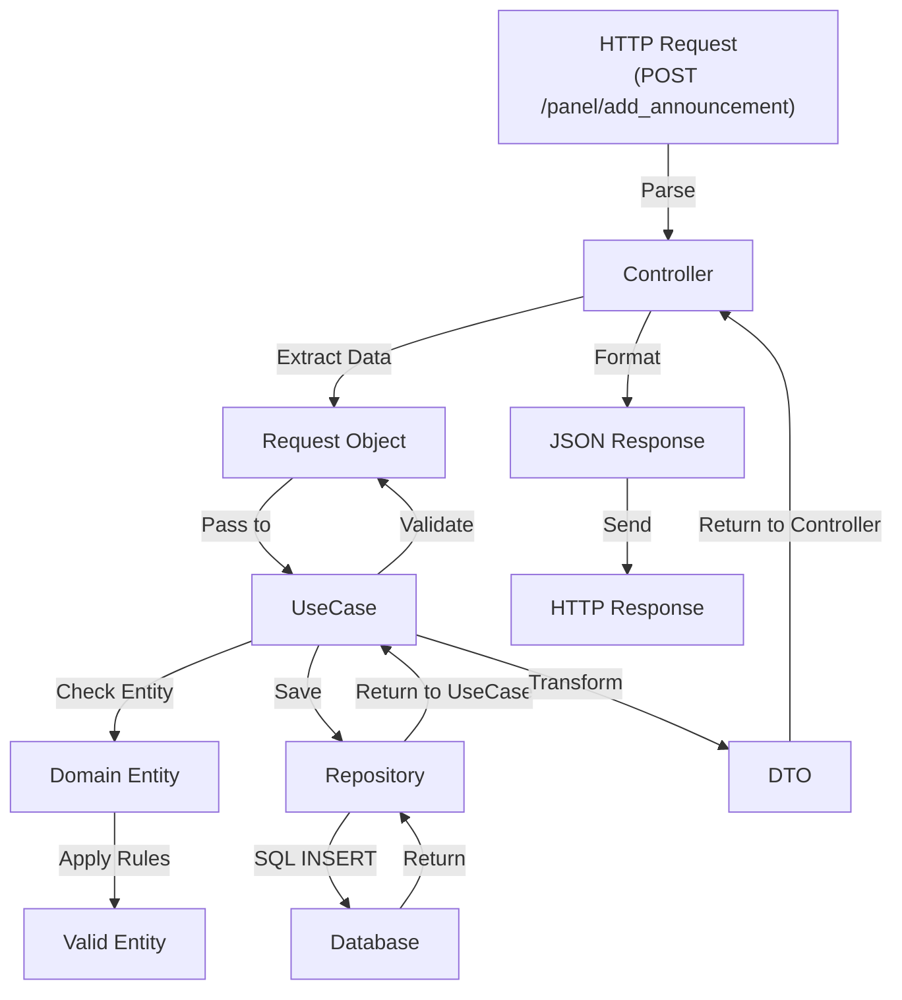

# Application Layer - API Reference

Warstwa Application orkiestruje logikę biznesową, koordynując interakcje między Presentation a Domain Layer.

## 📍 Struktura Application Layer

```
src/Application/
├── UseCase/                        # Główne scenariusze użytkownika
│   ├── Announcement/
│   │   ├── CreateAnnouncementUseCase.php
│   │   ├── ApproveAnnouncementUseCase.php
│   │   ├── RejectAnnouncementUseCase.php
│   │   ├── DeleteAnnouncementUseCase.php
│   │   └── ListAnnouncementsUseCase.php
│   ├── Word/
│   │   ├── CreateWordUseCase.php
│   │   ├── UpdateWordUseCase.php
│   │   └── ListWordsUseCase.php
│   ├── Quote/
│   │   └── ... (similar structure)
│   ├── User/
│   │   ├── RegisterUserUseCase.php
│   │   ├── LoginUserUseCase.php
│   │   └── UpdateUserUseCase.php
│   └── Module/
│       └── ...
└── DataTransferObject/             # Data Transfer Objects
    ├── AnnouncementDTO.php
    ├── UserDTO.php
    ├── WordDTO.php
    ├── QuoteDTO.php
    └── ...
```

**Namespace**: `App\Application\`

---

## 🎬 Use Cases

Use Case reprezentuje pojedynczy, znaczący scenariusz działania aplikacji.

---

## 📦 Data Transfer Objects (DTOs)

DTOs transportują dane między warstwami bez logiki biznesowej.


---

---

## 🔄 Typowy Flow Use Case

```
HTTP Request
    ↓
Controller
├─ 1. Parse request → AnnouncementDTO
├─ 2. Call useCase->execute($dto)
    ↓
UseCase
├─ 1. Validate request ($request->validate())
├─ 2. Create Domain Entity (Announcement::createNew())
├─ 3. Save via Repository
├─ 4. Return success
    ↓
Controller
├─ 1. Return HTTP Response
    ↓
HTTP Response (JSON)
```



---

## 🛡️ Exception Handling

Use Cases powinny zgłaszać wyjątki domenowe, które są obsługiwane na level Controllera.

```php
// UseCase
try {
    $announcement = $this->repository->findById($id);
    if (!$announcement) {
        throw new AnnouncementNotFoundException();
    }
} catch (DatabaseException $e) {
    throw new AnnouncementException("Failed to fetch announcement");
}

// Controller
try {
    $dto = $this->useCase->execute($request);
    return Response::ok($dto);
} catch (AnnouncementNotFoundException $e) {
    return Response::notFound("Announcement not found");
} catch (AnnouncementException $e) {
    return Response::badRequest($e->getMessage());
} catch (ValidationException $e) {
    return Response::unprocessableEntity($e->getErrors());
} catch (Exception $e) {
    $this->logger->error($e);
    return Response::internalServerError();
}
```

---

## 📊 Request → UseCase → Response Pattern

| Etap | Komponent      | Format       |
|------|----------------|--------------|
| 1    | HTTP Body      | JSON         |
| 2    | Controller     | Array        |
| 3    | Request Object | Typed Object |
| 4    | UseCase        | DTO          |
| 5    | Response       | JSON         |

---

## 🎓 Best Practices

### ✅ DO

1. **Waliduj każdy Request**
   ```php
   $errors = $request->validate();
   if (!empty($errors)) {
       throw new ValidationException($errors);
   }
   ```

2. **Użyj jednego Use Case na scenariusz**
   ```php
   // ✅ GOOD
   class CreateAnnouncementUseCase { }
   class ApproveAnnouncementUseCase { }
   
   // ❌ BAD
   class AnnouncementUseCase { // trop wiele odpowiedzialności
   }
   ```

3. **Transformuj Entity do DTOs**
   ```php
   $dto = AnnouncementDTO::fromEntity($entity);
   return $dto;
   ```

4. **Deleguj logikę biznesową do Domain**
   ```php
   $announcement->approve($adminId); // Domain handles rules
   ```

5. **Obsługuj wyjątki domenowe**
   ```php
   } catch (AnnouncementException $e) {
       return Response::badRequest($e->getMessage());
   }
   ```

### ❌ DON'T

1. **Nie rób SQL w Use Case**
   ```php
   // ❌ WRONG
   $result = $this->pdo->query("SELECT...");
   ```

2. **Nie mieszaj logiki z różnych scenariuszy**
   ```php
   // ❌ WRONG
   class AnnouncementUseCase {
       public function create() { }
       public function approve() { }
       public function list() { }
   }
   ```

3. **Nie zwracaj Entity bezpośrednio**
   ```php
   // ❌ WRONG
   return $entity; // Expose domain model
   
   // ✅ RIGHT
   return AnnouncementDTO::fromEntity($entity);
   ```

4. **Nie pomiń walidacji**
   ```php
   // ❌ WRONG
   public function execute($request) {
       // Assume input is valid
   }
   
   // ✅ RIGHT
   public function execute($request) {
       $errors = $request->validate();
       if (!empty($errors)) throw new ValidationException();
   }
   ```

---

## 📚 Use Case Checklist

Przy tworzeniu nowego Use Case pamiętaj, aby:

- [ ] Unikalny scenariusz (jedna odpowiedzialność)
- [ ] Request object z walidacją
- [ ] Walidacja w execute()
- [ ] Domain Entity creation/manipulation
- [ ] Repository call (save, find, etc)
- [ ] Exception handling
- [ ] DTO transformation
- [ ] Clear return type
- [ ] Unit tests
- [ ] Documentation
