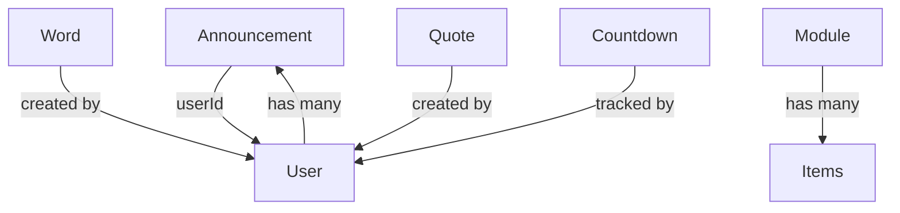

# Domain Layer - API Reference

Warstwa Domain zawiera czystą logikę biznesową projektu DoDomuDojadę, niezależną od technicznych szczegółów implementacji.

## 📍 Struktura Domain Layer

```
src/Domain/
├── Entity/               # Główne agregaty i entity
│   ├── Announcement.php  # Ogłoszenia
│   ├── User.php          # Użytkownicy
│   ├── Word.php          # Słowa dnia
│   ├── Quote.php         # Cytaty
│   ├── Module.php        # Moduły
│   └── Countdown.php     # Odliczanie
├── Enum/                 # Enumeracje
│   ├── AnnouncementStatus.php
│   ├── UserRole.php
│   └── ...
├── ValueObject/          # Niezmienne obiekty wartości
│   └── (będą rozwijane w przyszłości)
└── Exception/            # Wyjątki domenowe
    ├── DomainException.php
    ├── AnnouncementException.php
    └── ...
```

**Namespace**: `App\Domain\`

---

## 🎯 Entities (Agregaty)

### Announcement Entity

**Lokalizacja**: `src/Domain/Entity/Announcement.php`

Główny agregat zarządzający ogłoszeniami w aplikacji.

#### Charakterystyka
- **ID**: Unikalne w systemie
- **Status**: PENDING, APPROVED, REJECTED
- **Workflow**: Proposal → Review → Approval/Rejection
- **Lifecycle**: Od stworzenia do wygaśnięcia

#### Konstruktor
```php
public function __construct(
    public ?int               $id,
    public string             $title,
    public string             $text,
    public DateTimeImmutable  $createdAt,
    public DateTimeImmutable  $validUntil,
    public ?int               $userId,
    public AnnouncementStatus $status = AnnouncementStatus::PENDING,
    public ?DateTimeImmutable $decidedAt = null,
    public ?int               $decidedBy = null,
)
```

#### Właściwości
| Właściwość | Typ | Opis |
|-----------|-----|------|
| `$id` | `?int` | Unikalny identyfikator (null dla nowych) |
| `$title` | `string` | Tytuł ogłoszenia |
| `$text` | `string` | Treść ogłoszenia |
| `$createdAt` | `DateTimeImmutable` | Data utworzenia |
| `$validUntil` | `DateTimeImmutable` | Data wygaśnięcia |
| `$userId` | `?int` | ID twórcy/zatwierdzającego |
| `$status` | `AnnouncementStatus` | Status (PENDING/APPROVED/REJECTED) |
| `$decidedAt` | `?DateTimeImmutable` | Data zatwierdzenia/odrzucenia |
| `$decidedBy` | `?int` | ID osoby zatwierdzającej |

#### Factory Methods

**createNew()** - Stwórz nowe ogłoszenie od razu zatwierdzone
```php
public static function createNew(
    string            $title,
    string            $text,
    DateTimeImmutable $validUntil,
    int               $userId,
): self
```
Parametry:
- `$title`: Tytuł ogłoszenia
- `$text`: Treść ogłoszenia
- `$validUntil`: Data wygaśnięcia
- `$userId`: ID użytkownika tworzącego

Zwraca: Nowy agregat z statusem APPROVED

Użycie:
```php
$announcement = Announcement::createNew(
    title: "Nowe godziny otwarcia",
    text: "Od poniedziałku zmieniamy godziny...",
    validUntil: new DateTimeImmutable('2026-02-01'),
    userId: 1
);
```

**proposeNew()** - Stwórz nowe ogłoszenie czekające na zatwierdzenie
```php
public static function proposeNew(
    string $title,
    string $text,
    DateTimeImmutable $validUntil
): self
```
Parametry:
- `$title`: Tytuł ogłoszenia
- `$text`: Treść ogłoszenia
- `$validUntil`: Data wygaśnięcia

Zwraca: Nowy agregat z statusem PENDING

Użycie:
```php
$announcement = Announcement::proposeNew(
    title: "Propozycja nowego ogłoszenia",
    text: "To jest propozycja którą admin będzie recenzować",
    validUntil: new DateTimeImmutable('+1 month')
);
```

#### Business Methods

**approve()** - Zatwierdź ogłoszenie
```php
public function approve(int $decidedBy): void
```
Parametry:
- `$decidedBy`: ID użytkownika zatwierdzającego (admina)

Efekty:
- Zmienia status na APPROVED
- Ustawia `$decidedAt` na bieżący czas
- Ustawia `$decidedBy` na ID zatwierdzającego

Invariants:
- Status musi być PENDING
- `$decidedBy` musi być ważnym ID użytkownika

Użycie:
```php
if ($announcement->status === AnnouncementStatus::PENDING) {
    $announcement->approve(adminId: 2);
}
```

**reject()** - Odrzuć ogłoszenie
```php
public function reject(int $decidedBy): void
```
Parametry:
- `$decidedBy`: ID użytkownika odrzucającego (admina)

Efekty:
- Zmienia status na REJECTED
- Ustawia `$decidedAt` na bieżący czas
- Ustawia `$decidedBy` na ID odrzucającego

Invariants:
- Status musi być PENDING
- `$decidedBy` musi być ważnym ID użytkownika

Użycie:
```php
if ($announcement->status === AnnouncementStatus::PENDING) {
    $announcement->reject(adminId: 2);
}
```

**isValid()** - Sprawdź czy ogłoszenie jest ważne (aktualnie widoczne)
```php
public function isValid(): bool
```

Zwraca: `true` jeśli:
- Status = APPROVED
- Bieżący czas <= validUntil

Użycie:
```php
if ($announcement->isValid()) {
    // Wyświetl ogłoszenie użytkownikowi
    displayAnnouncement($announcement);
}
```

---

### User Entity

**Lokalizacja**: `src/Domain/Entity/User.php`

Entity reprezentująca użytkownika systemu.

```php
final class User {
    public function __construct(
        public ?int    $id,
        public string  $email,
        public string  $passwordHash,
        public string  $name,
        public ?string $phoneNumber = null,
        public string  $role = 'user'
    )
}
```

#### Właściwości
| Właściwość | Typ | Opis |
|-----------|-----|------|
| `$id` | `?int` | Unikalny identyfikator |
| `$email` | `string` | Email użytkownika |
| `$passwordHash` | `string` | Zahaszowane hasło |
| `$name` | `string` | Nazwa użytkownika |
| `$phoneNumber` | `?string` | Numer telefonu (opcjonalnie) |
| `$role` | `string` | Rola (user, admin, moderator) |

---

### Word Entity

**Lokalizacja**: `src/Domain/Entity/Word.php`

Entity reprezentująca słowo dnia.

```php
final class Word {
    public function __construct(
        public ?int    $id,
        public string  $word,
        public string  $definition,
        public string  $example,
        public string  $language = 'pl'
    )
}
```

#### Właściwości
| Właściwość | Typ | Opis |
|-----------|-----|------|
| `$id` | `?int` | Unikalny identyfikator |
| `$word` | `string` | Słowo |
| `$definition` | `string` | Definicja |
| `$example` | `string` | Przykład użycia |
| `$language` | `string` | Język (domyślnie polski) |

---

### Quote Entity

**Lokalizacja**: `src/Domain/Entity/Quote.php`

Entity reprezentująca cytat inspirujący.

```php
final class Quote {
    public function __construct(
        public ?int    $id,
        public string  $text,
        public string  $author,
        public string  $category = 'general'
    )
}
```

#### Właściwości
| Właściwość | Typ | Opis |
|-----------|-----|------|
| `$id` | `?int` | Unikalny identyfikator |
| `$text` | `string` | Tekst cytatu |
| `$author` | `string` | Autor cytatu |
| `$category` | `string` | Kategoria cytatu |

---

### Module Entity

**Lokalizacja**: `src/Domain/Entity/Module.php`

Entity reprezentująca moduł funkcjonalny aplikacji.

```php
final class Module {
    public function __construct(
        public ?int    $id,
        public string  $name,
        public string  $description,
        public bool    $enabled = true
    )
}
```

#### Właściwości
| Właściwość | Typ | Opis |
|-----------|-----|------|
| `$id` | `?int` | Unikalny identyfikator |
| `$name` | `string` | Nazwa modułu |
| `$description` | `string` | Opis modułu |
| `$enabled` | `bool` | Czy moduł jest włączony |

---

### Countdown Entity

**Lokalizacja**: `src/Domain/Entity/Countdown.php`

Entity reprezentująca odliczanie do ważnego zdarzenia.

```php
final class Countdown {
    public function __construct(
        public ?int              $id,
        public string            $title,
        public DateTimeImmutable $targetDate,
        public string            $description = ''
    )
}
```

#### Właściwości
| Właściwość | Typ | Opis |
|-----------|-----|------|
| `$id` | `?int` | Unikalny identyfikator |
| `$title` | `string` | Tytuł odliczania |
| `$targetDate` | `DateTimeImmutable` | Data docelowa |
| `$description` | `string` | Opis zdarzenia |

---

## 🏷️ Enums (Enumeracje)

### AnnouncementStatus Enum

**Lokalizacja**: `src/Domain/Enum/AnnouncementStatus.php`

Status ogłoszenia w workflow.

```php
enum AnnouncementStatus {
    case PENDING;      // Oczekuje na zatwierdzenie
    case APPROVED;     // Zatwierdzone i widoczne
    case REJECTED;     // Odrzucone
}
```

#### Stany Transitional
```
┌─────────┐
│ PENDING │
├────┬────┤
│    │    │
▼    ▼    │
APPROVED  REJECTED
```

**Przejścia**:
- PENDING → APPROVED (approve)
- PENDING → REJECTED (reject)
- APPROVED ↛ (terminal state)
- REJECTED ↛ (terminal state)

#### Użycie
```php
// Sprawdzenie statusu
if ($announcement->status === AnnouncementStatus::PENDING) {
    // Czeka na zatwierdzenie
}

// Walidacja przejścia
if ($announcement->status === AnnouncementStatus::PENDING) {
    $announcement->approve($userId);
}
```

---

## ⚠️ Exceptions (Wyjątki Domenowe)

**Lokalizacja**: `src/Domain/Exception/`

### DomainException (Abstract Base)

```php
abstract class DomainException extends Exception
```

Bazowa klasa dla wszystkich wyjątków domenowych.

**Charakterystyka**:
- Reprezentuje błędy biznesowe, nie techniczne
- Powinna być obsługiwana na poziomie Application
- Zawiera informacje dla użytkownika

### AnnouncementException

```php
class AnnouncementException extends DomainException
```

Wyjątek dla błędów związanych z Announcement.

**Przykłady**:
```php
throw new AnnouncementException(
    "Nie można zatwierdzić ogłoszenia które nie jest w stanie PENDING"
);
```

---

## 📋 Value Objects (Przyszłość)

Value Objects będą wprowadzane w przyszłości dla:

### Email Value Object
```php
final class Email {
    private function __construct(
        public readonly string $value
    ) {
        if (!filter_var($value, FILTER_VALIDATE_EMAIL)) {
            throw new InvalidEmailException();
        }
    }
    
    public static function create(string $value): self {
        return new self($value);
    }
    
    public function equals(Email $other): bool {
        return $this->value === $other->value;
    }
}
```

### PhoneNumber Value Object
```php
final class PhoneNumber {
    private function __construct(
        public readonly string $value
    ) {
        // Walidacja formatu telefonu
    }
}
```

### DateRange Value Object
```php
final class DateRange {
    public function __construct(
        public readonly DateTimeImmutable $startDate,
        public readonly DateTimeImmutable $endDate
    ) {
        if ($startDate > $endDate) {
            throw new InvalidDateRangeException();
        }
    }
    
    public function contains(DateTimeImmutable $date): bool {
        return $date >= $this->startDate && $date <= $this->endDate;
    }
}
```

---

## 🎓 Best Practices w Domain Layer

### ✅ DO

1. **Umieszczaj logikę biznesową w Entity**
   ```php
   public function isValid(): bool {
       return $this->status === AnnouncementStatus::APPROVED
           && new DateTimeImmutable() <= $this->validUntil;
   }
   ```

2. **Używaj Value Objects do walidacji**
   ```php
   public function __construct(
       public Email $email,
       public PhoneNumber $phone
   )
   ```

3. **Definiuj invariants explicite**
   ```php
   // Og łoszenie może być zatwierdzone tylko jeśli było w stanie PENDING
   public function approve(int $decidedBy): void {
       // implicit invariant check
       $this->status = AnnouncementStatus::APPROVED;
   }
   ```

4. **Zwracaj Entity ze statycznych metod**
   ```php
   public static function createNew(...): self {
       return new self(...);
   }
   ```

### ❌ DON'T

1. **Nie importuj Infrastructure w Domain**
   ```php
   // ❌ WRONG
   use App\Infrastructure\Repository\AnnouncementRepository;
   ```

2. **Nie rób SQL queries w Entity**
   ```php
   // ❌ WRONG
   $result = $this->pdo->query("SELECT...");
   ```

3. **Nie parsuj JSON/XML w Entity**
   ```php
   // ❌ WRONG
   $data = json_decode($request->getBody());
   ```

4. **Nie używaj getters/setters dla wszystkiego**
   ```php
   // ❌ WRONG
   public function getStatus() { return $this->status; }
   public function setStatus($status) { $this->status = $status; }
   
   // ✅ RIGHT
   public function approve($userId) { 
       // apply business rules
       $this->status = AnnouncementStatus::APPROVED;
   }
   ```

---

## 🔗 Relacje Między Entities



---

## 📊 Complete Domain Namespace Reference

| Klasa | Lokalizacja | Typ | Opis |
|-------|-------------|-----|------|
| Announcement | Entity/ | Entity | Ogłoszenie |
| User | Entity/ | Entity | Użytkownik |
| Word | Entity/ | Entity | Słowo dnia |
| Quote | Entity/ | Entity | Cytat |
| Module | Entity/ | Entity | Moduł |
| Countdown | Entity/ | Entity | Odliczanie |
| AnnouncementStatus | Enum/ | Enum | Status ogłoszenia |
| DomainException | Exception/ | Abstract | Bazowy wyjątek |
| AnnouncementException | Exception/ | Exception | Wyjątek dla Announcement |
