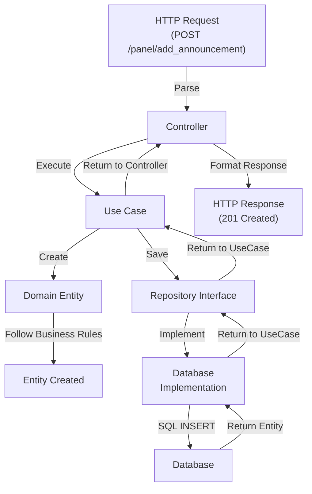

# Architektura Domain-Driven Design

## Wstęp do DDD

**Domain-Driven Design (DDD)** to metodologia projektowania software'u, która kładzie nacisk na głębokie zrozumienie domeny biznesowej i odzwierciedlenie tej wiedzy w kodzie. Projekt DoDomuDojade implementuje DDD i clean architecture z wyraźnym podziałem na warstwy.


## Trochę o architekturze (Dla początkujących)
Projekt stara się utrzymać zgodność z architekturą DDD (Domain-Driven Design).

Punktem wejściowym całej aplikacji jest `index.php`. To tam znajdują się wszystkie ścieżki oraz ich obsługa.

Index zaczyna od inicjacji `bootstrap.php` w `src/bootstrap/bootstrap.php`. Tu z kolei dzieje się druga część magii. Wszystkie instancje klas są inicjowane, tak, żeby mogły potem zostać wykorzystane w DI (Dependency Injection).

Żeby wyjaśnić działanie aplikacji, przyjrzyjmy się przykładowej ścieżce `/login`.
1. Nasz serwer odpytuje `index.php` o tę ścieżkę
2. W router obecny w `index.php` odnajduje właściwą klasę i funkcję do uruchomienia. Jak to robi? Otóż w opisie ścieżki `$r->addRoute('GET', '/login', [LoginController::class, 'login']);` zawarta jest ta informacja.
3. Router uruchamia funkcję `login` w klasie `PanelController::class`
4. Funkcja login w akcji. (Poniżej przytaczam kod). Odziedziczona po `BaseController.php` funkcja render jest wykorzystywana do przekazania do użytkownika pliku z katalogu `src/Presentation`
```
public function show(): ResponseInterface
    {
        $this->logger->debug("Render login page request received");
        return $this->render(TemplateNames::LOGIN->value);
    }
```
Ot cała magia ✨

Warto dodać, że niektóre ścieżki zawierają tzw. "middleware". Jest ono częścią wspólną między różnymi warstwami aplikacji. W naszej aplikacji na tę chwilę znajduje się middleware odpowiedzialne za:
- csrf (cross-site request forgery)
- translacje
- uwierzytelnianie

## 🎯 Główne Zasady DDD w Projekcie

### 1. Ubiquity of Language (Wszechobecność Języka)
Kod i dokumentacja używają jednolitego słownika biznesowego:
- **Announcement** — Ogłoszenie
- **Countdown** — Odliczanie
- **Quote** — Cytat
- **Word** — Słowo

## 🏗️ Warstwy Oprogramowania

### Warstwa Domain (src/Domain)
**Odpowiedzialność**: Zawiera czystą logikę biznesową niezależną od technologii

#### Entities
Entity reprezentuje obiekt z unikalną tożsamością (ID), który zmienia się w czasie.

```php
// Przykład: Announcement Entity
final class Announcement {
    public function __construct(
        public ?int               $id,
        public string             $title,
        public string             $text,
        public DateTimeImmutable  $createdAt,
        public DateTimeImmutable  $validUntil,
        public ?int               $userId,
        public AnnouncementStatus $status = AnnouncementStatus::PENDING,
        public ?DateTimeImmutable $decidedAt = null,
        public ?int               $decidedBy = null,
    ){}
    
    // Factory methods
    public static function createNew(...): self { }
    public static function proposeNew(...): self { }
    
    // Business methods
    public function approve(int $decidedBy): void { }
    public function reject(int $decidedBy): void { }
    public function isValid(): bool { }
}
```

**Cechy Entity:**
- Ma identyfikator (ID)
- Może być modyfikowana
- Zawiera zachowanie biznesowe (metody)
- Definiuje reguły biznesowe (invariants)

#### Value Objects
Value Objects reprezentują wartości, które nie zmieniają się i nie mają tożsamości.

```php
// Przykład: Password
final readonly class Password
{
    private string $hash;

    public function __construct(
        string $plainPassword,
        int $minLength = 8
    ) {
        if (mb_strlen($plainPassword) < $minLength) {
            throw ValidationException::invalidInput(['password' => ["Password too short (min $minLength)"]]);
        }
        $this->hash = password_hash($plainPassword, PASSWORD_DEFAULT);
    }
    
    // Getter
    public function getHash(): string {}

    // Business logic
    public function verify(string $plainPassword): bool { }
}
```

**Cechy Value Object:**
- Niezmienność (immutable)
- Brak ID
- Porównanie po wartości, nie po referencji
- Samodzielna walidacja

#### Enums
Typy i statusy domeny.

```php
// Przykład: Announcement Status
enum AnnouncementStatus {
    case PENDING;
    case APPROVED;
    case REJECTED;
}
```

#### Exceptions
Wyjątki domenowe reprezentujące błędy biznesowe.

```php
// W src/Domain/Exception/
class AnnouncementException extends DomainException { }
class InvalidAnnouncementStatusException extends AnnouncementException { }
```

### Warstwa Application (src/Application)
**Odpowiedzialność**: Orkiestracja logiki biznesowej, UseCase-y

```
src/Application/
├── UseCase/              # Główne scenariusze użytkownika
│   ├── Announcement/
│   │   ├── CreateAnnouncementUseCase.php
│   │   ├── ApproveAnnouncementUseCase.php
│   │   └── RejectAnnouncementUseCase.php
│   └── ...
└── DataTransferObject/   # Obiekty transferu danych
    ├── AnnouncementDTO.php
    └── ...
```

#### Use Cases
Use Case opisuje pojedynczy, znaczący scenariusz użytkowania aplikacji.

```php
// Struktura Use Case
class CreateAnnouncementUseCase {
    public function __construct(
        private AnnouncementRepository $repository,
        // inne zależności
    ) {}
    
    public function execute(CreateAnnouncementRequest $request): void {
        // 1. Validate request
        // 2. Create domain entity
        // 3. Call repository to save
        // 4. Trigger domain events (future)
    }
}
```

**Charakterystyka Use Case:**
- Jedna odpowiedzialność
- Orkiestracja między Domain a Infrastructure
- Brak logiki biznesowej (deleguje do Domain)
- Obsługuje zdarzenia i błędy

#### Data Transfer Objects (DTOs)
DTO-s transportują dane między warstwami bez logiki biznesowej.

```php
class AnnouncementDTO {
    public function __construct(
        public int    $id,
        public string $title,
        public string $text,
        public string $status,
        // ... inne pola
    ) {}
}
```

**Kiedy używać DTO-s:**
- Transfer danych z HTTP Request/Response
- Komunikacja między Use Cases
- Serializacja/deserializacja

### Warstwa Infrastructure (src/Infrastructure)
**Odpowiedzialność**: Implementacja technicznych szczegółów

```
src/Infrastructure/
├── Repository/        # Implementacja repozytoriów
│   ├── AnnouncementRepository.php
│   └── UserRepository.php
├── Service/           # Serwisy zewnętrzne
│   ├── ExternalApiService.php
│   └── EmailService.php
├── Factory/           # Fabryki do tworzenia obiektów
├── Security/          # Komponenty bezpieczeństwa
│   └── AuthenticationService.php
├── Helper/            # Funkcje pomocnicze
├── Translation/       # Tłumaczenia
├── Trait/             # Traity wspólne
├── View/              # View helpers
└── Container.php      # DI Container
```

#### Repositories
Repository abstrahuje dostęp do danych (patrz: Repository Pattern).

```php
// Interface w Domain
interface AnnouncementRepository {
    public function save(Announcement $announcement): void;
    public function findById(int $id): ?Announcement;
    public function findAll(): array;
    public function delete(Announcement $announcement): void;
}

// Implementacja w Infrastructure
class DatabaseAnnouncementRepository implements AnnouncementRepository {
    public function save(Announcement $announcement): void {
        // SQL INSERT/UPDATE
    }
    
    public function findById(int $id): ?Announcement {
        // SQL SELECT
    }
}
```

**Rola Repository:**
- Abstrakcja dostępu do danych
- Brak SQL w Domain Layer
- Łatwa zamiana implementacji (np. mock w testach)
- Zgodność z DIP (Dependency Inversion Principle)

#### External Services
Serwisy integrujące się z zewnętrznymi API.

```php
class ExternalWordService {
    public function fetchDailyWord(): Word {
        // HTTP call do external API
        // Transformacja do Domain Entity
    }
}

class EmailService {
    public function send(string $email, string $message): void {
        // Sending email via SMTP/external service
    }
}
```

#### Factories
Fabryki tworzą kompleksowe obiekty.

```php
class AnnouncementFactory {
    public static function createFromRequest(
        CreateAnnouncementRequest $request
    ): Announcement {
        return Announcement::createNew(
            title: $request->title,
            text: $request->text,
            validUntil: $request->validUntil,
            userId: $request->userId,
        );
    }
}
```

### Warstwa Presentation (src/Http, src/Console)
**Odpowiedzialność**: Interfejsy użytkownika (HTTP, CLI)

```
src/Http/
├── Controller/      # HTTP Controllers
│   ├── AnnouncementController.php
│   ├── UserController.php
│   └── ...
└── Response/        # Response helpers

src/Console/
└── Command/         # CLI Commands
    ├── FetchDailyWordCommand.php
    ├── FetchDailyQuoteCommand.php
    └── ...
```

**Charakterystyka Controllers:**
- Parsowanie HTTP Request
- Delegowanie do Use Case
- Formatowanie Response
- Obsługa HTTP specific logic (routing, auth, validation)

## 🔄 Przepływ Danych

### Typowy Scenariusz: Tworzenie Ogłoszenia

```
1. HTTP Request (POST /panel/add_anndouncement)
        ↓
2. Controller (AnnouncementController)
   - Parsuje request
   - Tworzy DTO
        ↓
3. Use Case (CreateAnnouncementUseCase)
   - Tworzy Domain Entity
        ↓
4. Domain Entity (Announcement)
   - Aplikuje reguły biznesowe
        ↓
5. Repository Interface
        ↓
6. Repository Implementation (DatabaseAnnouncementRepository)
   - Wykonuje SQL INSERT
   - Zwraca entity z ID
        ↓
7. Use Case
   - Zwraca success
        ↓
8. Controller
   - Formatuje response
        ↓
9. HTTP Response (201 Created)
```



## 🛡️ Invariants

Invariants to reguły biznesowe, które muszą być spełnione.

### Announcement Invariants
1. Announcement musi mieć unikalny tytuł (w kontekście)
2. Announcement musi mieć `validUntil` >= `createdAt`
3. Zatwierdzenie zmienia status z PENDING na APPROVED
4. Odrzucenie zmienia status z PENDING na REJECTED
5. Ogłoszenie jest ważne, tylko jeśli status = APPROVED i teraz < validUntil

``` php
public function isValid(): bool {
    return $this->status === AnnouncementStatus::APPROVED
        && new DateTimeImmutable() <= $this->validUntil;
}
```

## 📦 Dependency Injection

Projekt używa DI Container (`src/Infrastructure/Container.php`) zgodny z psr-11 `ContainerInterface`.

```php
// Container Registration
$container->register(
    AnnouncementRepository::class,
    new DatabaseAnnouncementRepository($pdo)
);

// Usage in Controller
$container->get(AnnouncementRepository::class);
```

**Zasady:**
- Domain nie zależy od Infrastructure
- Application zależy od Domain interfaces
- Infrastructure implementuje Domain interfaces
- Presentation zależy od Application i Domain

## 🎓 Best Practices

### Domain Layer
✅ DO:
- Implementuj reguły biznesowe
- Używaj Value Objects
- Zwracaj Entity z metodami
- Definiuj wyjątki domenowe

❌ DON'T:
- Nie importuj Infrastructure
- Nie rób SQL queries
- Nie parsuj JSON/XML
- Nie loguj (przynajmniej nie w core)

### Application Layer
✅ DO:
- Orkiestruj UseCase
- Waliduj DTO-s
- Transformuj między Domain a Presentation

❌ DON'T:
- Nie implementuj reguł biznesowych
- Nie bezpośrednio korzystaj z bazy
- Nie mieszaj logiki różnych Use Cases

### Infrastructure Layer
✅ DO:
- Implementuj Repository interfaces
- Integruj z zewnętrznymi serwisami
- Zarządzaj baza danych
- Konfiguruj zależności

❌ DON'T:
- Nie implementuj reguł biznesowych
- Nie używaj Domain bezpośrednio w SQL
- Nie twórz Service Locator (używaj DI)

### Presentation Layer
✅ DO:
- Parsuj HTTP requests
- Waliduj input
- Deleguj do Use Cases
- Formatuj responses

❌ DON'T:
- Nie implementuj logiki biznesowej
- Nie dostępuj bezpośrednio do bazy
- Nie rób żadnych transformacji Entity

## 🔗 Relacje Między Warstwami

```
Domain Layer
    ↑
    │ depends on (implements interface)
    │
Application Layer
    ↑
    │ depends on (calls)
    │
Presentation Layer (Http, Console)
    
    
Infrastructure Layer
    │ implements
    ↓
Domain Layer (interfaces only)
```

**Kluczowa Reguła**: Infrastructure NIGDY nie importuje Application, Application importuje Domain interfaces które są implementowane w Infrastructure.

## 📚 Namespace Mapping

| Warstwa        | Namespace                    | Przykład                                                       |
|----------------|------------------------------|----------------------------------------------------------------|
| Domain         | `App\Domain\`                | `App\Domain\Entity\Announcement`                               |
| Application    | `App\Application\`           | `App\Application\UseCase\CreateAnnouncementUseCase`            |
| Infrastructure | `App\Infrastructure\`        | `App\Infrastructure\Repository\DatabaseAnnouncementRepository` |
| Presentation   | `App\Http\` / `App\Console\` | `App\Http\Controller\AnnouncementController`                   |

## 🚀 Rozszerzanie Projektu

Aby dodać nową funkcjonalność (np. nowy moduł):

1. **Stwórz Entity w Domain**
   ```php
   // src/Domain/Entity/NewEntity.php
   final class NewEntity { }
   ```

2. **Zdefiniuj Enums (jeśli potrzebne)**
   ```php
   // src/Domain/Enum/NewEntityStatus.php
   enum NewEntityStatus { }
   ```

3. **Stwórz Use Cases w Application**
   ```php
   // src/Application/UseCase/CreateNewEntityUseCase.php
   class CreateNewEntityUseCase { }
   ```

4. **Implementuj Repository w Infrastructure (jeśli potrzebne)**
   ```php
   // src/Infrastructure/Repository/DatabaseNewEntityRepository.php
   class DatabaseNewEntityRepository { }
   ```

5. **Zarejestruj w DI Container**
   ```php
   // src/Infrastructure/Container.php
   $container->register(NewEntityRepository::class, $implementation);
   ```